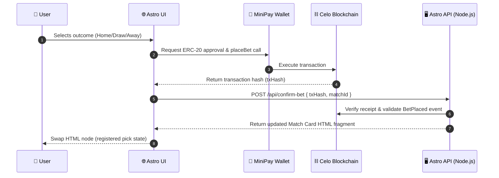

# 🏗️ Architecture - Project Ball

Project Ball combines high-speed web experiences with secure, decentralized stablecoin mechanics on the Celo blockchain.

---

## 🔄 Runtime Flow

Astro handles server-side rendering (SSR) of match lists for immediate, SEO-friendly loads. The client-side logic (vanilla TypeScript) governs wallet connection, token approvals, and transaction dispatching. Once Celo confirms a transaction, `htmx` performs a clean swap of the specific match card UI using an HTML response generated by the backend API.



---

## 💾 Data Boundaries

```
┌──────────────────────────────────────┐     ┌──────────────────────────────────────┐
│        ⛓️ ON-CHAIN STATE             │     │      📂 OFF-CHAIN (PostgreSQL)       │
├──────────────────────────────────────┤     ├──────────────────────────────────────┤
│ - Total normalized stakes            │     │ - Football match schedules & cache   │
│ - Settlement outcomes & resolved flag│     │ - User profile & session cookies     │
│ - Individual address stakes & tokens │     │ - Analytics logs & stats snapshots   │
│ - Accumulated token fees & balances  │     │ - Support tickets & metadata cache   │
└──────────────────────────────────────┘     └──────────────────────────────────────┘
```

* **On-Chain Boundaries:** Pure monetary state, prediction claims, stablecoin token deposits, refunds, and resolution status are stored in `ProjectBallPools.sol`.
* **Off-Chain Boundaries:** PostgreSQL houses the match catalog, scheduled kickoff times, team names, user metadata, and historical stats.

---

## 💵 Multi-Stablecoin Pot Math

> [!NOTE]
> All stablecoins are counted 1:1 in USD value.

1. **Staking/Normalization:**
   Stablecoins with fewer decimals (e.g. USDC/USDT with 6 decimals) are scaled to **18 decimals** upon betting:
   $$\text{normalized} = \text{amount} \times 10^{(18 - \text{decimals})}$$
   Accounting in the contract uses these normalized values for pool sizing and odds.

2. **Payout Basket:**
   Instead of performing swaps (which introduce oracle/slippage issues), winners claim a **proportional basket** of the actual tokens held in the pool:
   $$\text{payout}_{token} = \frac{\text{poolBalance}_{token} \times \text{userNormalized}}{\text{winnerNormalized}}$$
   This means that if a pool has $100$ USDC and $100$ USDT, and a winner owns $10\%$ of the winning shares, they claim $10$ USDC and $10$ USDT.

---

## 🏆 Leaderboard & Caching Architecture

To prevent severe database bottlenecks and maintain fast page loads, the global leaderboard is decoupled from real-time individual user queries:

1. **Denormalized Cache Table:** Ranks, bet counts, and scores are persisted in the `user_leaderboard` table.
2. **O(1) Bulk Aggregation:** A secured backend endpoint (`POST /api/leaderboard/refresh`) performs a single bulk query of all bet confirmations and computes user accuracy and estimated winnings completely in-memory. This solves N+1 query limits on D1/PostgreSQL.
3. **Whale Mitigation:** To prevent massive single-bet winners ("whales") from destroying the competitive ranking curve, total winnings are scaled logarithmically (`Math.log10(totalWonUsd + 1)`) before being normalized against the top earner. The final combined score is a weighted average of accuracy (60%) and the normalized log-winnings (40%).
