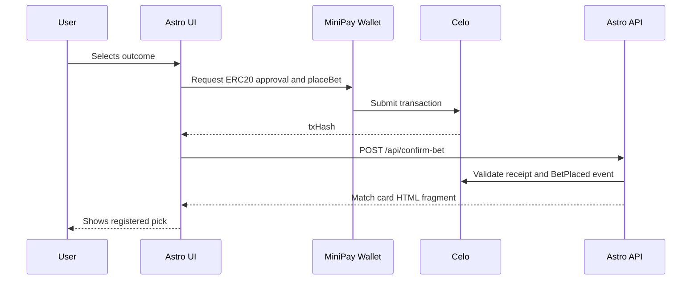

# Architecture

## Runtime Flow

Astro renders match cards server-side for fast initial load. Vanilla TypeScript owns wallet detection, stablecoin selection, approval, bet submission, and transaction confirmation. htmx swaps only the affected match card after the API verifies the transaction receipt.

## Data Boundaries

- On-chain: stakes, outcomes, fees, claims, refunds, and match settlement state.
- D1/off-chain: match schedule cache, UI confirmation records, stats snapshots, and support metadata.
- Static docs: legal pages, network manifest, and submission checklist.

## Multi-Stablecoin Pot

USDm, USDC, and USDT count 1:1 as USD value. The contract normalizes all stakes to 18 decimals for accounting while preserving the token-specific balances. Winner claims are paid as a proportional basket from the remaining pool tokens.
